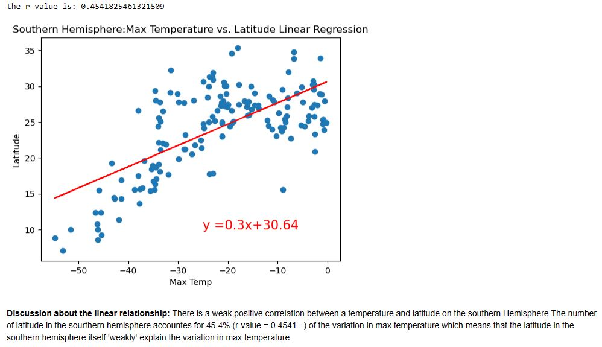
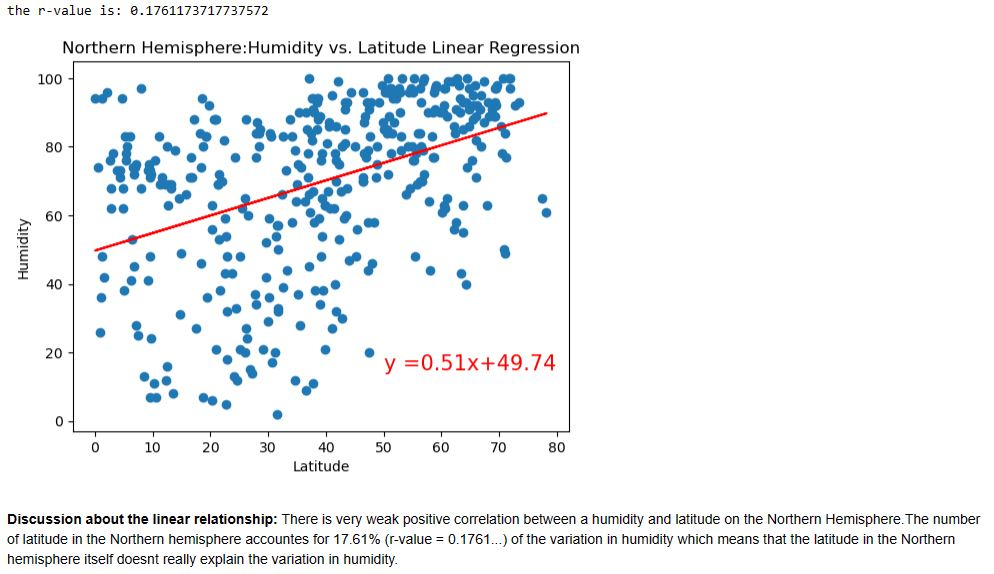
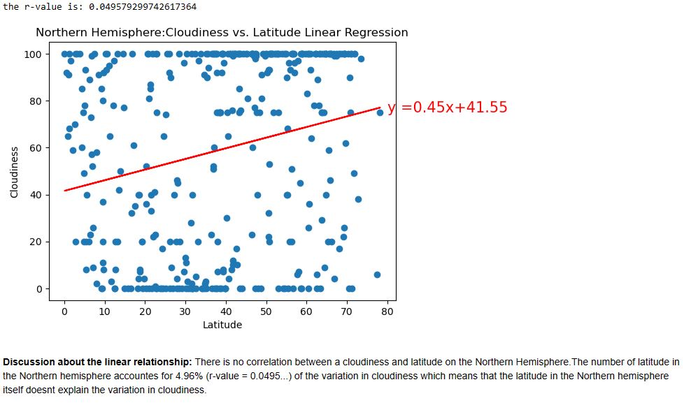
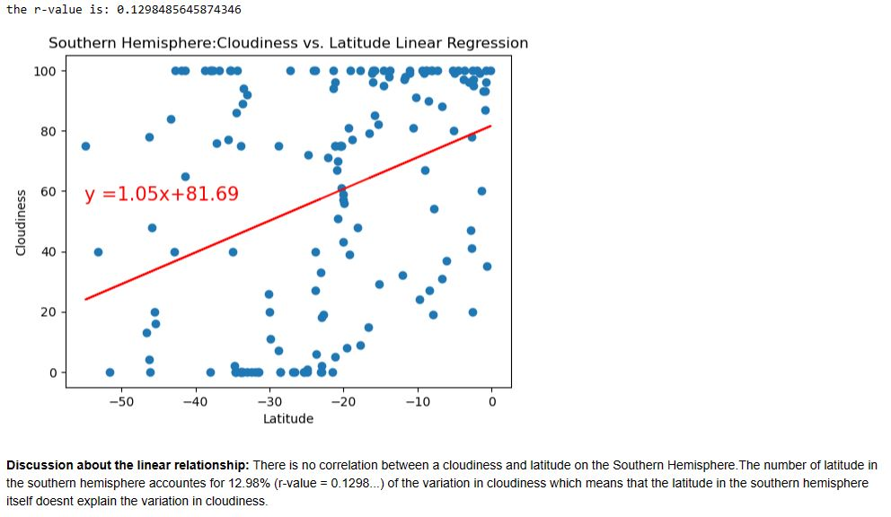
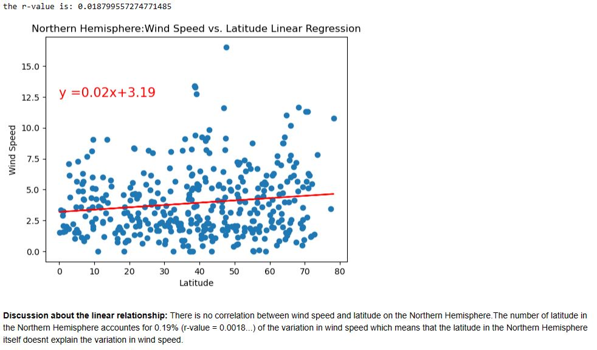
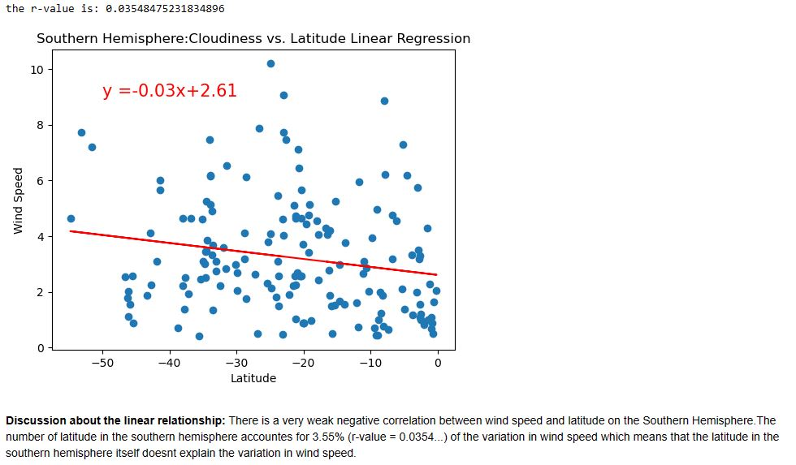
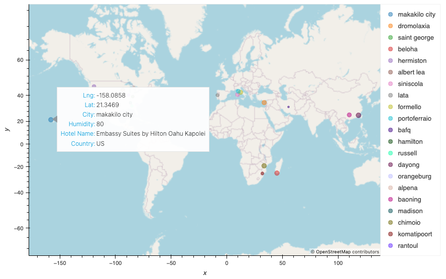

# Exploring Weather Patterns and Planning Vacations

 
## Introduction
In this data exploration journey, we delve into the fascinating world of weather patterns and travel planning. By utilising Python's capabilities, we answer questions about the relationship between weather variables and latitude and go beyond by planning vacation destinations based on specific weather conditions. The journey comprises two parts: WeatherPy and VacationPy, both aimed at revealing insights and aiding vacation planning.

## Part 1: WeatherPy
WeatherPy utilises Python's versatility, citipy library, and the OpenWeatherMap API to analyse weather data from over 500 cities around the world. The focus is on visualising the connections between various weather variables and latitude. Scatter plots are employed to showcase the correlations between latitude and temperature, humidity, cloudiness, and wind speed. Linear regression analysis is applied to understand these relationships more deeply.

### Temperature vs. Latitude Linear Regression Plot

### Humidity vs. Latitude Linear Regression Plot

### Cloudiness vs. Latitude Linear Regression Plot

## Wind Speed vs. Latitude Linear Regression Plot

## Part 2: VacationPy
The second part, VacationPy, takes a practical twist by planning future vacations using Python. GeoViews and the Geoapify API come into play to create map visualisations and find suitable vacation spots. By narrowing down cities based on preferred weather conditions like temperature, wind speed, and cloudiness, we generate a map displaying cities with humidity as point size. Additionally, using the Geoapify API, we identify the closest hotels within a certain radius of these chosen cities and display hotel information on the map.

By addressing the core question of weather trends as we approach the equator and transforming data-driven insights into actionable vacation plans, this exploration not only enriches our understanding of weather phenomena but also showcases the real-world applications of Python programming in data analysis and travel planning.
